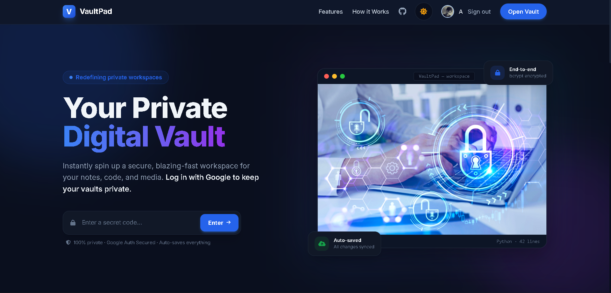
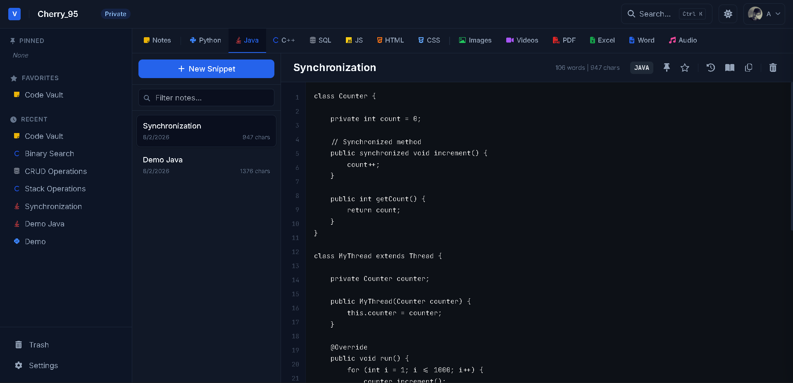
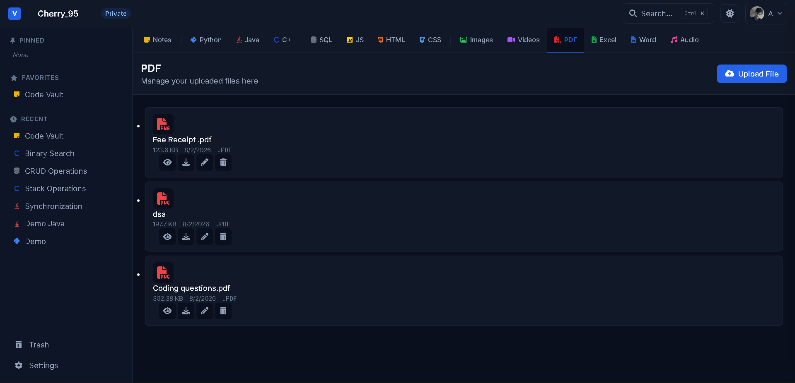
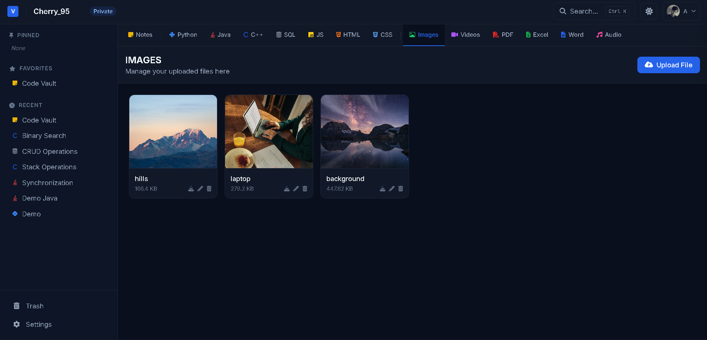
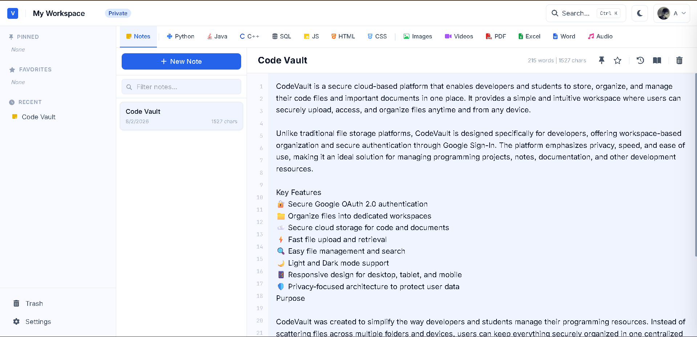

# 🔐 VaultPad – Secure Code & File Storage Platform

<div align="center">


### A Secure Platform to Store Files, Images, and Code Snippets

</div>

---

# 📖 Overview

VaultPad is a secure web application that allows users to store, organize, and manage their important files and code snippets in one place.

The platform provides secure user authentication, personal storage, image processing, and an intuitive dashboard for managing uploaded content. Every user's data remains isolated and protected through authenticated sessions.

---

# ✨ Features

## 🔐 Authentication

- User Registration
- Secure Login
- Logout
- Google OAuth Login
- Password Hashing using bcrypt
- Session-based Authentication

---

## 📂 File Management

- Upload Files
- Download Files
- Delete Files
- View Uploaded Files
- Personal File Storage

---

## 🖼 Image Handling

- Image Upload
- Image Optimization using Sharp
- Profile Picture Support

---

## 💻 Code Storage

- Save Code Snippets
- View Saved Snippets
- Edit Snippets
- Delete Snippets
- Organize Development Notes

---

## 👤 User Dashboard

- Personalized Dashboard
- Recent Uploads
- User-specific Data
- Easy Navigation

---

# 🛠 Tech Stack

## Frontend

* EJS, HTML5, CSS3, Javascript

## Backend

* Node.js, Express.js

## Database

* MongoDB, Mongoose

## Authentication

* Passport.js, Google OAuth 2.0, Express Session

## File Handling

* Multer, Sharp

---

# 📁 Project Structure

```
VaultPad
│
├── app.js
├── package.json
├── config/
├── controllers/
├── middleware/
├── models/
├── public/
│   ├── css/
│   ├── js/
│   ├── uploads/
│   └── images/
├── routes/
├── views/
├── utils/
└── README.md
```

---

## 📊 File Size Limits

| Type | Limit |
|------|-------|
| Images (.jpg/.png/.gif/.webp/.svg) | **10 MB** |
| PDF | **20 MB** |
| Word (.doc/.docx) | **20 MB** |
| Excel (.xls/.xlsx/.csv) | **20 MB** |
| Audio (.mp3/.wav/.ogg/.aac/.flac) | **50 MB** |
| Video (.mp4/.webm/.mov/.avi) | **100 MB** |
| Notes / Code | **5 MB** |

---

# 🔒 Security Features

- Password Encryption using bcrypt
- Secure Sessions
- Google OAuth Authentication
- User-specific Data Isolation
- Input Validation
- Protected Routes

---

# 📸 Screenshots

### 🏠 Home Page

<p align="center">
  
</p>

---

### 🔒 Secure Vault

<p align="center">
  
</p>

---

### ☕ Java Workspace

<p align="center">
  
</p>

---

### 📄 PDF Workspace

<p align="center">
  
</p>

---

### 🖼 Image Workspace

<p align="center">
  
</p>

---

### 💻 Code Vault

<p align="center">
  
</p>

---

</div>

## 🌐 Live Demo

**🔗 Live Website:** https://vaultpad-secure-code-file-storage.onrender.com/
